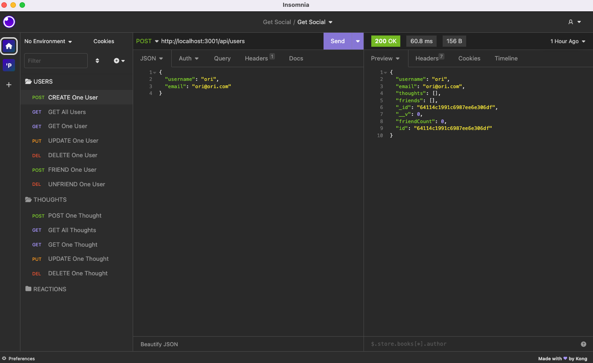

# Get-social

## Technology Used 

|Technology | Resource |
|-----|:-----------|
| Git | [https://git-scm.com/](https://git-scm.com/)  
| Node.js | [https://nodejs.org/docs/latest-v16.x/api/](https://nodejs.org/docs/latest-v16.x/api/) |
| MongoDb	| [https://www.mongodb.com/docs/atlas/](https://www.mongodb.com/docs/atlas/) |
| Mongoose |[https://mongoosejs.com/docs/index.html](https://mongoosejs.com/docs/index.html)|
| Express.js | [https://expressjs.com/en/guide/routing.html](https://expressjs.com/en/guide/routing.html)|
| Insomnia | [https://docs.insomnia.rest/](https://docs.insomnia.rest/)

## Description

Get Social, a social network api, allows builders to create users, thoughts and reactions. When testing in Insomnia you are able to take the below actions. 

* Create users (POST)
* Get all (or one) user(s) (GET)
* Update users (PUT)
* Delete users (DEL)
* Friend users (POST)
* Unfriend users (DEL)
* Create thoughts (POST)
* Get all (or one) thought(s) (GET)
* Update thoughts (PUT)
* Delete thoughts (DEL)

[Click here to view a video walk-through of API routes testing in Insomnia](https://drive.google.com/file/d/18aWZDMGCexFye20OxgDvpnL6KvWr_bjk/view)

## Table of Contents
* [Code Highlight](#code-highlight)
* [Author Info](#author-info)
* [Credits](#credits)
* [License](#license)

## Code Highlight

### Delete that comment(reaction)!

Companies that moderate their social media engagement oftentimes find themselves deleting reactions or comments that are not in line with brandguidelines. Controller functions, such as the one in the below code, defines a controller function for handling an HTTP DELETE request to delete a specific reaction from a thought. 

When the function is called, it uses the Thought.findOneAndUpdate() method to find and update a thought document in the database. It finds the thought document with the specified thoughtId and removes a reaction with the specified reactionId from the reactions array in the thought document.

The $pull operator is used to remove the reaction from the reactions array in the thought document. If the thought document is found and updated, the function sends a 200 HTTP response, else it sends a 404 HTTP response with a JSON message stating that no thought was found. 

.png)

## Author Info

### Henner Espinoza

* [LinkedIn](https://www.linkedin.com/in/hennerespinoza)

* [GitHub](https://github.com/justhenner)

## Credits

* Suresh Kumar, Tutor

* Study group members

## License

MIT License